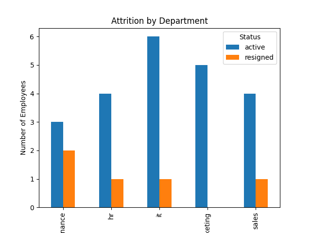

# HR Employee Data Cleaning & Analysis (Python/Pandas)

I cleaned and analyzed a realistically messy HR dataset using pandas. This project demonstrates real-world data wrangling and presents the results in a clean, readable format.

## The Problem

The raw HR data included 30 employees with missing values, duplicate employees entered under two different IDs, inconsistent text casing, and mixed date formats.

## Cleaning Steps

| Issue | Method | What I did |
|---|---|---|
| Inconsistent text casing | `.str.lower()` | Fixed the casing so all department and status values match |
| Missing values | `.groupby().transform('mean')` + `.fillna()` | Calculated each department's average salary and filled it into the missing Salary values. Missing Designation was filled with "Unknown" |
| Duplicate employees (two different IDs) | `df.duplicated()` + `df.drop_duplicates(subset=[...], keep='first')` | Matched rows on Name, Department, Salary and Join_Date, then kept the first entry and removed the repeats |
| Mixed date formats | `pd.to_datetime(..., format='mixed')` | Read each date's format individually instead of assuming all dates share one format |
| Extra whitespace in names | `.str.strip()` | Removed leading and trailing spaces so identical names are not treated as different values |

Result: 30 raw rows became 27 cleaned rows.

## Analysis

- Calculated how long each employee has worked, in days and in years, from their joining date
- Counted active and resigned employees: 22 active, 5 resigned
- Calculated the average salary by department
- Compared attrition by department: Finance had the highest, and Marketing had none

## Files

- `employee_data_raw.csv`: original messy data
- `employee_data_cleaned.csv`: cleaned data after pandas processing
- `hr_data_cleaning_analysis.py`: full script for cleaning, analysis and the chart
- `attrition_by_department.png`: chart of attrition by department
- `pandas_cheat_sheet.md`: summary of every pandas method I used, explained in plain English

## Key Takeaway

I used pandas to clean the data by filling missing values, removing extra spaces that would break grouping and counting, and removing duplicate employee entries that had different IDs. I then used matplotlib to visualize attrition by department.

